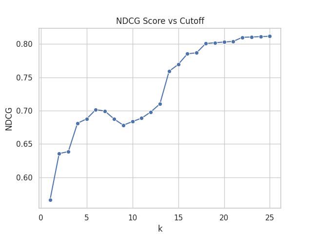

# LOINC AdaRank Ranking

This is a simple implementation of the AdaRank algorithm to rank relevant documents for a given query. The dataset used is the LOINC dataset, which is a set of lab tests and their corresponding codes.

## AdaRank

AdaRank is a machine learning algorithm for ranking tasks that uses boosting to optimize ranking metrics directly. It iteratively combines weak rankers to minimize errors in ranking results by assigning higher weights to misranked items. AdaRank ensures that the final model improves on metrics like NDCG (Normalized Discounted Cumulative Gain) or MAP (Mean Average Precision) rather than traditional loss functions.

## Performance

NDCG (Normalized Discounted Cumulative Gain) is a metric used to evaluate the quality of ranked lists, such as search results or recommendation systems. It measures how well the ranked items match the ideal order of relevance, giving more weight to higher-ranked items. The score ranges from 0 to 1, where 1 indicates perfect ranking. NDCG considers both the relevance of the items and their positions in the list, rewarding models that place highly relevant items at the top and penalizing those that misplace them further down.

<br>
<div align="center">
  
  <br><br>
  <em>NDCG score for different cutoff values.</em>
</div>
<br>

The provided plot shows the model's performance in ranking tasks at various cutoff points (k). Initially, at low values of k, the NDCG score is relatively low, indicating that the most relevant items are not always ranked at the top. However, as k increases, the score improves significantly, reflecting better ranking of the top items. After k=16, the score stabilizes, peaking at around 0.81 by k=25, suggesting that the model performs consistently well for longer ranked lists. The gradual improvement and eventual plateau indicate that while the model is effective at identifying relevant items, there is diminishing improvement as the ranking depth increases, highlighting areas where further refinement could enhance the top-ranked item positioning.

<br>
<div align="center">
  <em>Model performance across iterations.</em>
</div>
<br>

```
1       0.4111012201813297      109     [0.38845439 0.19132288 0.18044579 0.9727727  0.21404082]        train 0.3894    valid 0.3894
2       0.39388126294966763     73      [0.45661398 0.10477076 0.77158208 0.28404842 0.21404082]        train 0.4824    valid 0.4824
3       0.39478803258383055     84      [0.24186627 0.67630341 0.25700953 0.31127573 0.26257811]        train 0.4819    valid 0.4819
4       0.42771572016035403     59      [0.99147648 0.19132288 0.20292642 0.24577326 0.20732319]        train 0.5213    valid 0.5213
5       0.3921355344911272      84      [0.24186627 0.67630341 0.25700953 0.31127573 0.26257811]        train 0.4118    valid 0.4118
6       0.39806011628530014     73      [0.45661398 0.10477076 0.77158208 0.28404842 0.21404082]        train 0.4980    valid 0.4980
7       0.3951792759864329      59      [0.99147648 0.19132288 0.20292642 0.24577326 0.20732319]        train 0.5123    valid 0.5123
8       0.3968037355494283      84      [0.24186627 0.67630341 0.25700953 0.31127573 0.26257811]        train 0.4635    valid 0.4635
9       0.374830952993401       84      [0.24186627 0.67630341 0.25700953 0.31127573 0.26257811]        train 0.4118    valid 0.4118
10      0.39806011628530014     73      [0.45661398 0.10477076 0.77158208 0.28404842 0.21404082]        train 0.4931    valid 0.4931
11      0.3944559963655336      59      [0.99147648 0.19132288 0.20292642 0.24577326 0.20732319]        train 0.5064    valid 0.5064
12      0.39449280809725756     84      [0.24186627 0.67630341 0.25700953 0.31127573 0.26257811]        train 0.4118    valid 0.4118
13      0.39806011628530014     73      [0.45661398 0.10477076 0.77158208 0.28404842 0.21404082]        train 0.4752    valid 0.4752
14      0.3938679780649763      109     [0.38845439 0.19132288 0.18044579 0.9727727  0.21404082]        train 0.4736    valid 0.4736
```

The table shows the performance of a model across multiple iterations, with each row representing a different iteration. The first column indicates the iteration number, while the second column displays the model's loss for that iteration. The third column shows a feature vector, representing model parameters. The "train" and "valid" columns show the model's performance on the training and validation datasets, respectively.

Throughout the iterations, there are fluctuations in performance, with some iterations (such as iteration 4) showing improvement in both training and validation scores, while others (like iteration 5) show relatively lower values. The performance is fairly consistent between training and validation, suggesting it is not overfitting or underfitting, though some iterations indicate room for further improvement.

## Setup

1. Clone the repository
```bash
git clone --recursive git@github.com:ikajdan/loinc_adarank_ranking.git
```

2. Set up the virtual environment
```bash
python3 -m venv .venv
source .venv/bin/activate
```

3. Install the dependencies
```bash
pip install -r requirements.txt
```

4. Run the script
```bash
python main.py
```

The ranking will be saved in the `out` directory.

```
+-----+-------+------+-------+-------+
| qid | docno | rank | score | relev |
+-----+-------+------+-------+-------+
|  1  |  23   |  1   | 0.282 |  2.0  |
|  1  |  44   |  2   | 0.261 |  1.0  |
|  1  |  53   |  3   | 0.247 |  2.0  |
|  1  |  20   |  4   | 0.191 |  3.0  |
|  1  |  62   |  5   | 0.186 |  1.0  |
|  1  |  57   |  6   | 0.178 |  1.0  |
|  1  |  50   |  7   | 0.165 |  1.0  |
|  1  |  39   |  8   | 0.133 |  1.0  |
|  1  |  27   |  9   | 0.127 |  1.0  |
|  1  |  35   |  10  |  0.0  |  1.0  |
...
|  2  |  11   |  1   | 0.196 |  2.0  |
|  2  |  33   |  2   | 0.178 |  4.0  |
|  2  |  21   |  3   | 0.178 |  2.0  |
|  2  |  57   |  4   | 0.178 |  2.0  |
|  2  |  95   |  5   |  0.0  |  1.0  |
|  2  |  14   |  6   |  0.0  |  2.0  |
|  2  |   3   |  7   |  0.0  |  1.0  |
|  2  |  48   |  8   |  0.0  |  1.0  |
|  2  |  25   |  9   |  0.0  |  1.0  |
|  2  |  26   |  10  |  0.0  |  1.0  |
...
|  3  |  24   |  1   | 0.451 |  2.0  |
|  3  |  39   |  2   | 0.133 |  1.0  |
|  3  |  17   |  3   |  0.0  |  1.0  |
|  3  |  86   |  4   |  0.0  |  1.0  |
|  3  |  101  |  5   |  0.0  |  2.0  |
|  3  |  15   |  6   |  0.0  |  2.0  |
|  3  |  41   |  7   |  0.0  |  2.0  |
|  3  |  98   |  8   |  0.0  |  1.0  |
|  3  |  70   |  9   |  0.0  |  1.0  |
|  3  |  94   |  10  |  0.0  |  1.0  |
...
|  4  |  24   |  1   | 0.451 |  2.0  |
|  4  |  23   |  2   | 0.282 |  2.0  |
|  4  |  21   |  3   | 0.178 |  2.0  |
|  4  |  57   |  4   | 0.178 |  2.0  |
|  4  |  22   |  5   | 0.165 |  2.0  |
|  4  |  41   |  6   |  0.0  |  2.0  |
|  4  |  83   |  7   |  0.0  |  1.0  |
|  4  |  100  |  8   |  0.0  |  1.0  |
|  4  |  61   |  9   |  0.0  |  1.0  |
|  4  |  64   |  10  |  0.0  |  1.0  |
...
|  5  |   1   |  1   | 0.403 |  2.0  |
|  5  |  19   |  2   | 0.292 |  2.0  |
|  5  |  39   |  3   | 0.133 |  1.0  |
|  5  |  55   |  4   |  0.0  |  2.0  |
|  5  |   6   |  5   |  0.0  |  2.0  |
|  5  |  63   |  6   |  0.0  |  1.0  |
|  5  |  17   |  7   |  0.0  |  1.0  |
|  5  |  51   |  8   |  0.0  |  1.0  |
|  5  |  99   |  9   |  0.0  |  1.0  |
|  5  |  71   |  10  |  0.0  |  1.0  |
...
+-----+-------+------+-------+-------+
```
